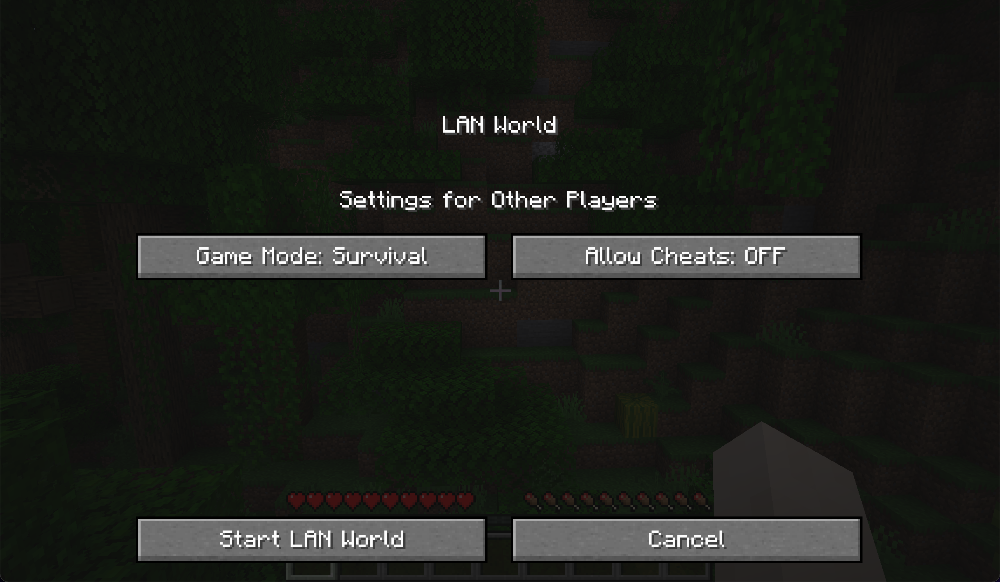
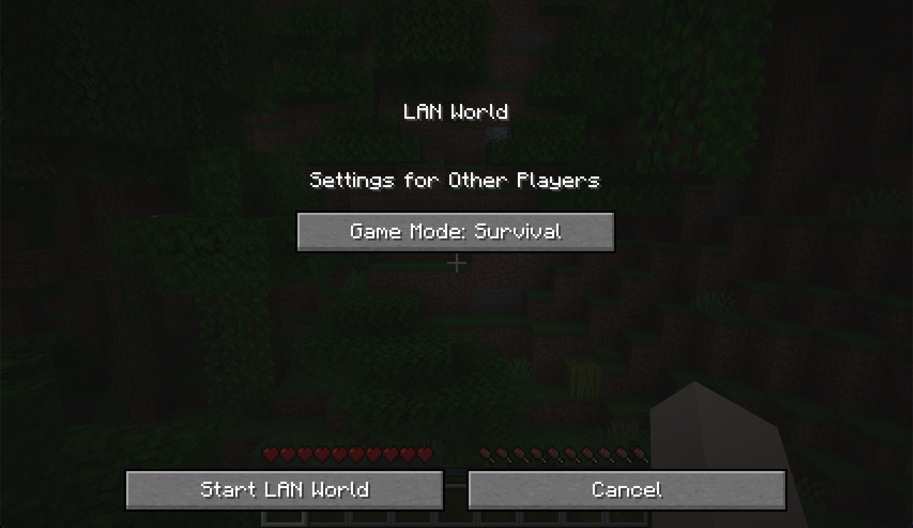

# NoLANCheatingFabric
“No LAN Cheating” ported to Fabric 1.18.x

Removes the temptation to cheat in single-player worlds, by removing the “Allow Cheats” button from the “Open to LAN” dialog.

Before:

After:

